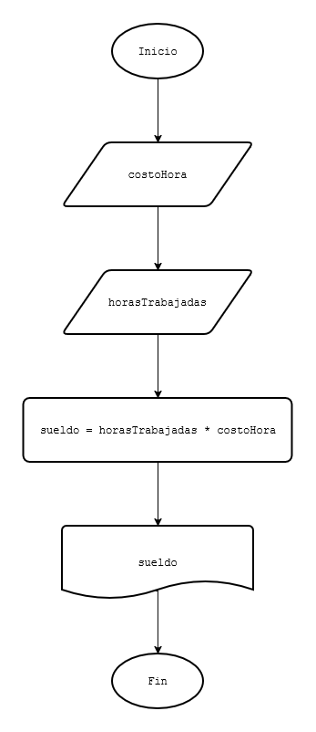

# 3 - Codificación del diagrama de flujo en lenguaje C
### Problema 1
Calcular el sueldo mensual de un operario conociendo la cantidad de horas trabajadas y el pago por hora.

##### Datos conocidos:
* Horas trabajadas en el mes.
* Pago por hora.

##### Proceso:
Cálculo del sueldo multiplicando la cantidad de horas por el pago por hora.

##### Información resultante:
Sueldo mensual

#### Diagrama de flujo
