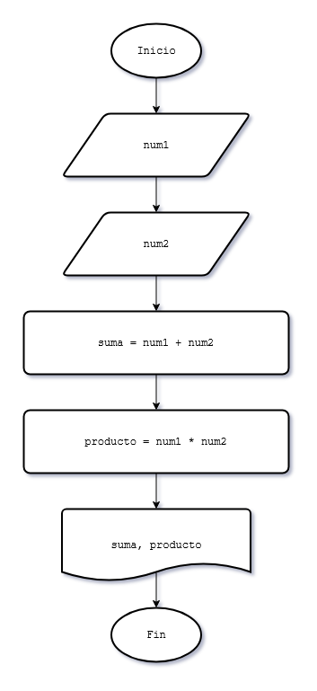

# 5 - Estructura de programación secuencial

En esta etapa, trabajamos con algoritmos donde las instrucciones se ejecutan una tras otra, sin saltos ni repeticiones, siguiendo un orden lineal de arriba hacia abajo.

### Operadores Aritméticos
Para realizar procesos matemáticos en C, utilizamos los operadores estándar. Es fundamental entender la jerarquía de las operaciones para obtener resultados precisos.

| Operador | Operación | Ejemplo en C |
| :---: | :--- | :--- |
| `+` | Suma | `total = a + b;` |
| `-` | Resta | `diferencia = a - b;` |
| `*` | Multiplicación | `producto = a * b;` |
| `/` | División | `cociente = a / b;` |
| `%` | Módulo (Resto) | `resto = a % b` |

**Dato de precisión:** Cuando dividimos dos números enteros (`int`), el resultado será truncado (se pierden los decimales). Para obtener un resultado exacto, al menos una de las variables debe ser de tipo `float`.


### Asignación de Valores
El operador `=` significa asignación. 
* La computadora resuelve lo que está a la derecha del `=` y guarda el resultado en la variable que está a la izquierda.
* **Ejemplo:** `superficie = lado * lado;`


### Casting (Conversión de tipos)
El **Casting** es una técnica que permite forzar temporalmente que una variable sea tratada como si fuera de otro tipo. Es fundamental en operaciones de división entre enteros para no perder la parte decimal.  
Consiste en anteponer el tipo de dato deseado entre paréntesis a una variable. Esto fuerza al compilador a tratar el valor como ese nuevo tipo de forma temporal.  
Debe aplicarse a uno de los operandos **antes** de la operación, no al resultado final de la misma.

#### ⚠️ Error común de precedencia
* **Incorrecto:** `(float)(a / b)`  
Aquí C primero realiza la división entre los dos enteros (truncando el resultado) y recién después convierte ese número ya truncado a float. **El error persiste.**

* **Correcto:** `(float)a / b`  
Aquí C convierte la variable `a` en float **antes** de realizar la operación. Al dividir un `float` por un `int`, el lenguaje promociona automáticamente toda la operación a punto flotante.

**Sintaxis:** `(tipo_nuevo)variable`

#### Ejemplo:
Tenemos dos enteros y queremos una división precisa:
```c
int total = 10;
int cantidad = 4;
float resultado;

// Sin casting: resultado = 2.000000 (se trunca)
// Con casting:
resultado = (float)total / cantidad; 
// Resultado: 2.500000
```


### Formateo de decimales
Por defecto, cuando usamos `%f` para mostrar un `float`, C imprime 6 lugares decimales (por ejemplo: `1500.500000`). Pero podemos limitar la cantidad de decimales en la salida indicandole al compilador la precisión deseada. Esto solo afecta a la visualización en pantalla, no cambia el valor real de la variable en la memoria.

* **Sintaxis:** `%.[cantidad]f`

#### Ejemplos:
* `%.2f`: Muestra 2 decimales (Ideal para moneda/dinero).
* `%.0f`: No muestra decimales (Redondea visualmente a entero).
* `%.3f`: Muestra 3 decimales.


### Problema 3
Realizar la carga de dos números enteros por teclado e imprimir su suma y su producto.

#### Diagrama de flujo



### Problema 4
Realizar la carga del lado de un cuadrado, mostrar por pantalla el perímetro del mismo (El perímetro de un cuadrado se calcula multiplicando el valor del lado por cuatro) 

### Problema 5
Escribir un programa en el cual se ingresen cuatro números, calcular e informar la suma de los dos primeros y el producto del tercero y el cuarto. 

### Problema 6
Realizar un programa que lea cuatro valores numéricos e informar su suma y promedio. 

### Problema 7
Se debe desarrollar un programa que pida el ingreso del precio de un artículo y la cantidad que lleva el cliente. Mostrar lo que debe abonar el comprador.
Definir una variable float para el precio del artículo. 