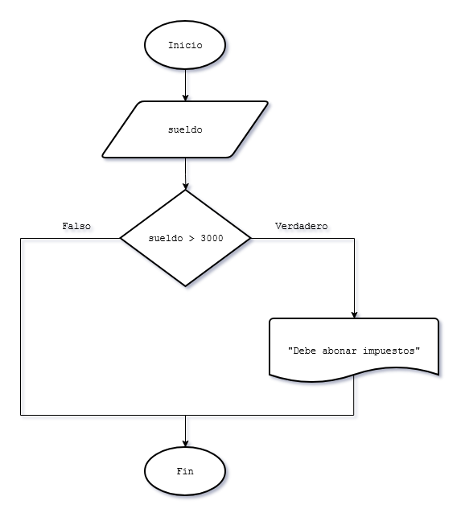
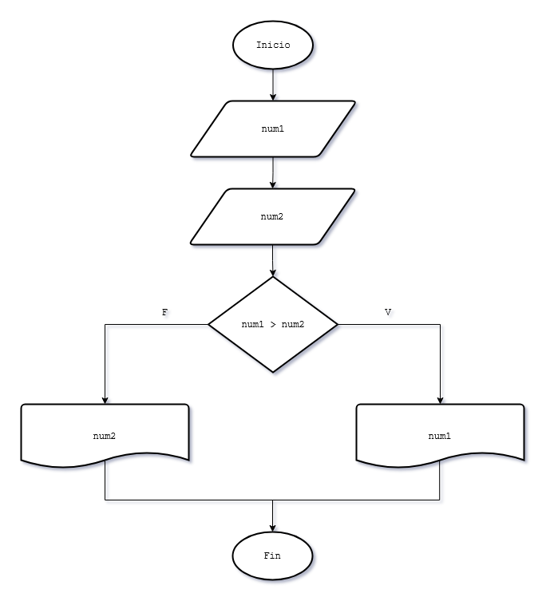

# 6 - Estructuras condicionales simples y compuestas
Las estructuras condicionales permiten que el programa tome decisiones. Dependiendo de si una condición es verdadera o falsa, el programa ejecutará un bloque de código u otro.  

## La Estructura `if` / `else`
Se compone de:
* **Condición:** Una expresión lógica entre paréntesis.
* **Bloque Verdadero:** Instrucciones que se ejecutan si la condición se cumple.
* **Bloque Falso (`else`):** Instrucciones que se ejecutan si la condición **no** se cumple.  

Existen dos tipos principales según su estructura:
### A. Estructura Condicional Simple
Es aquella donde solo se ejecutan acciones por el camino verdadero de la condición. Si la condición es falsa, el programa simplemente continúa con la siguiente instrucción sin realizar ninguna acción especial.

### B. Estructura Condicional Compuesta
En esta estructura, el programa tiene lógica definida para ambos escenarios. Contamos con entradas, salidas u operaciones tanto por la rama del verdadero (bloque `if`) como por la rama del falso (bloque `else`).
 

## Operadores Relacionales
Son los símbolos que utilizamos para evaluar la condición:

| Símbolo | Significado |
| :---: | :--- |
| `==` | Igual a (No confundir con `=` de asignación) |
| `!=` | Distinto de |
| `>`  | Mayor que |
| `<`  | Menor que |
| `>=` | Mayor o igual que |
| `<=` | Menor o igual que |

---
## Ejercitación

### Problema 8
Ingresar el sueldo de una persona, si supera los 3000 pesos mostrar un mensaje en pantalla indicando que debe abonar impuestos.

#### Diagrama de flujo

### Problema 9
Realizar un programa que solicite al operador ingresar dos números y muestre por pantalla el mayor de ellos.

#### Diagrama de flujo

### Problema 10
Realizar un programa que solicite la carga por teclado de dos números, si el primero es mayor al segundo informar su suma y diferencia, en caso contrario informar el producto y la división del primero respecto al segundo. 

### Problema 11
Se ingresan tres notas de un alumno, si el promedio es mayor o igual a siete mostrar un mensaje "Promocionado". 

### Problema 12
Se ingresa por teclado un número positivo de uno o dos dígitos (1..99) mostrar un mensaje indicando si el número tiene uno o dos dígitos.
(Tener en cuenta que condición debe cumplirse para tener dos dígitos un número entero) 

