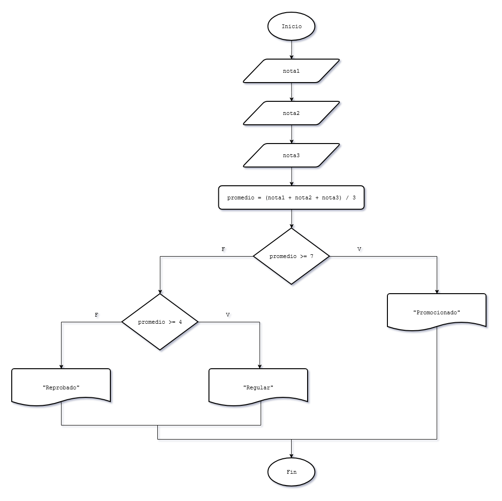

# 7 - Estructuras condicionales anidadas
Una estructura condicional es anidada cuando por la rama del verdadero o el falso de una estructura condicional hay otra estructura condicional.  
Se utiliza cuando existen más de dos caminos posibles y las condiciones son excluyentes. Permite evaluar una nueva condición solo si la anterior resultó falsa.

---
## Ejercitación

### Problema 13
Confeccionar un programa que pida por teclado tres notas de un alumno, calcule el promedio e imprima alguno de estos mensajes:
* Si el promedio es >=7 mostrar "Promocionado".
* Si el promedio es >=4 y <7 mostrar "Regular".
* Si el promedio es <4 mostrar "Reprobado". 

#### Diagrama de flujo

### Problema 14
Se cargan por teclado tres números distintos. Mostrar por pantalla el mayor de ellos. 

### Problema 15
Se ingresa por teclado un valor entero, mostrar una leyenda que indique si el número es positivo, negativo o nulo (es decir cero) 

### Problema 16
Confeccionar un programa que permita cargar un número entero positivo de hasta tres cifras y muestre un mensaje indicando si tiene 1, 2, o 3 cifras. Mostrar un mensaje de error si el número de cifras es mayor.

### Problema 17
Un postulante a un empleo, realiza un test de capacitación, se obtuvo la siguiente información: cantidad total de preguntas que se le realizaron y la cantidad de preguntas que contestó correctamente. Se pide confeccionar un programa que ingrese los dos datos por teclado e informe el nivel del mismo según el porcentaje de respuestas correctas que ha obtenido, y sabiendo que:
* Nivel máximo:	Porcentaje>=90%.
* Nivel medio:	Porcentaje>=75% y <90%.
* Nivel regular:	Porcentaje>=50% y <75%.
* Fuera de nivel:	Porcentaje<50%.