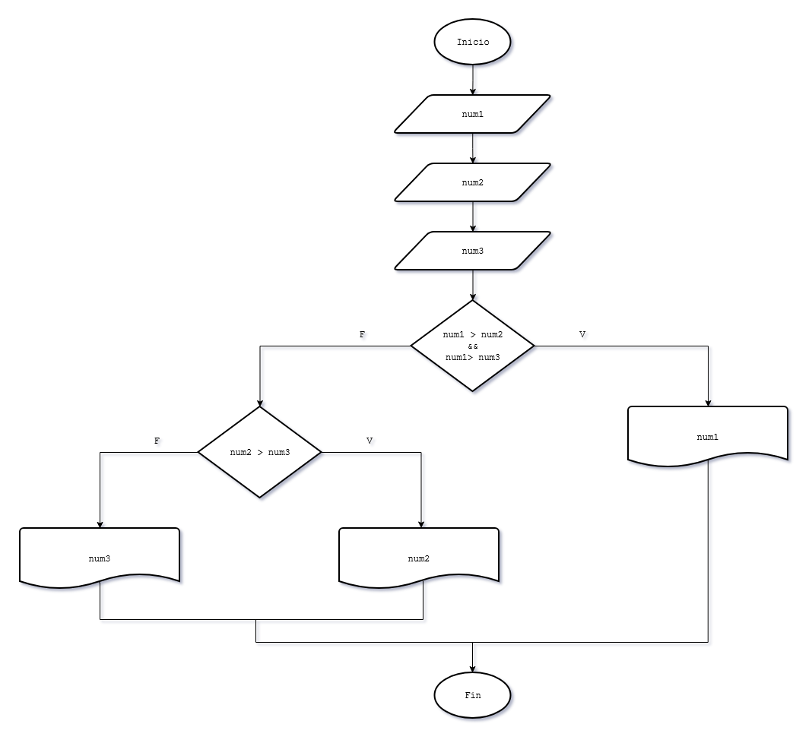
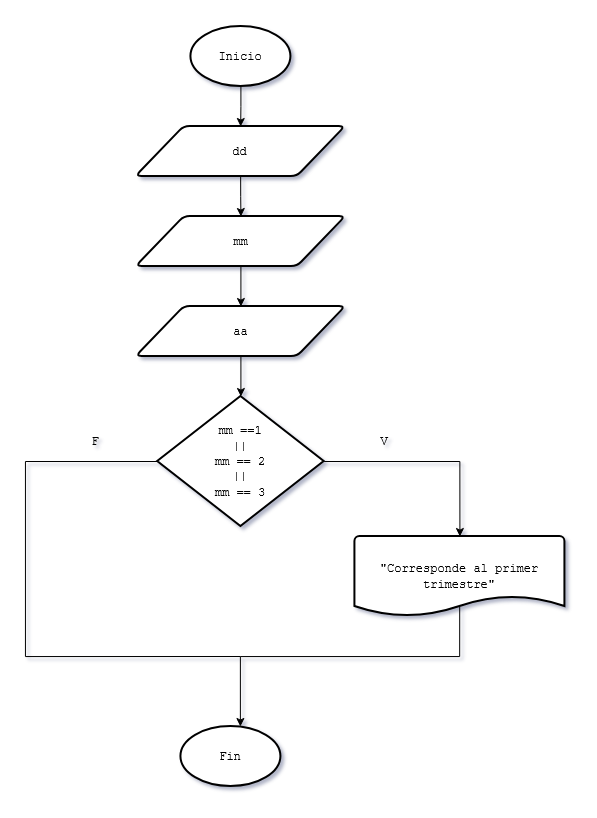

# 8 - Condiciones compuestas con operadores lógicos
### Problema 18
Confeccionar un programa que lea por teclado tres números distintos y nos muestre el mayor.

#### Diagrama de flujo

### Problema 19
Se carga una fecha (día, mes y año) por teclado. Mostrar un mensaje si corresponde al primer trimestre del año (enero, febrero o marzo) Cargar por teclado el valor numérico del día, mes y año.  
Ejemplo: dia:10 mes:2 año:2017. 

#### Diagrama de flujo

### Problema 20
Realizar un programa que pida cargar una fecha cualquiera, luego verificar si dicha fecha corresponde a Navidad. 

### Problema 21
Se ingresan tres valores por teclado, si todos son iguales se imprime la suma del primero con el segundo y a este resultado se lo multiplica por el tercero.

### Problema 22
Se ingresan por teclado tres números, si todos los valores ingresados son menores a 10, imprimir en pantalla la leyenda "Todos los números son menores a diez". 

### Problema 23
Se ingresan por teclado tres números, si al menos uno de los valores ingresados es menor a 10, imprimir en pantalla la leyenda "Alguno de los números es menor a diez". 

### Problema 24
Escribir un programa que pida ingresar la coordenada de un punto en el plano, es decir dos valores enteros x e y (distintos a cero).  
Posteriormente imprimir en pantalla en que cuadrante se ubica dicho punto.  
(1º Cuadrante si x > 0 Y y > 0 , 2º Cuadrante: x < 0 Y y > 0, etc.) 

### Problema 25
De un operario se conoce su sueldo y los años de antigüedad. Se pide confeccionar un programa que lea los datos de entrada e informe:
1. Si el sueldo es inferior a 500 y su antigüedad es igual o superior a 10 años, otorgarle un aumento del 20 %, mostrar el sueldo a pagar.
2. Si el sueldo es inferior a 500 pero su antigüedad es menor a 10 años, otorgarle un aumento de 5 %.
3. Si el sueldo es mayor o igual a 500 mostrar el sueldo en pantalla sin cambios. 

### Problema 26
Escribir un programa en el cual: dada una lista de tres valores numéricos distintos se calcule e informe su rango de variación  
(debe mostrar el mayor y el menor de ellos) 