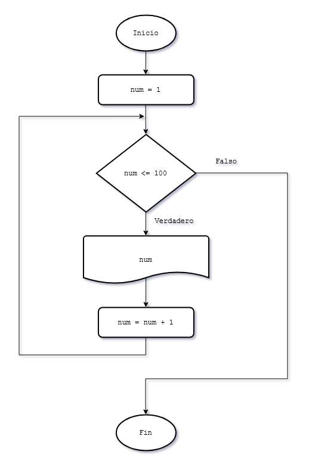
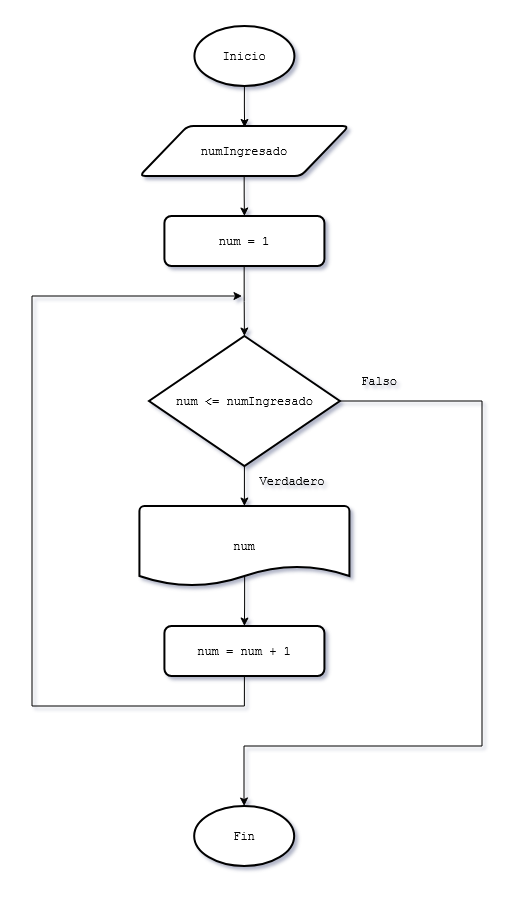
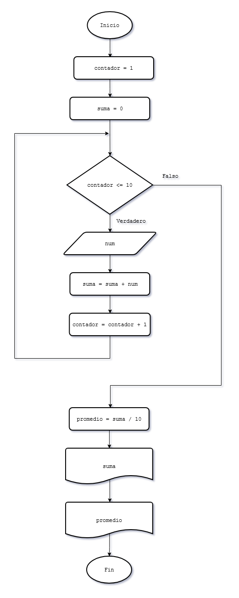
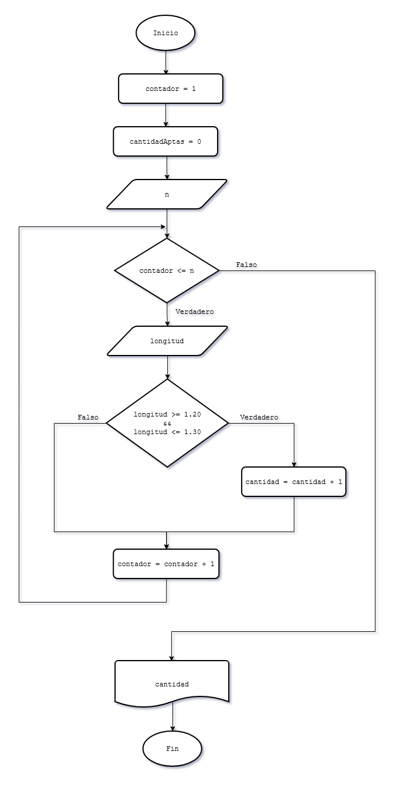

# 9 - Estructura repetitiva while

### Problema 17
Realizar un programa que imprima en pantalla los números del 1 al 100.

#### Diagrama de flujo

### Problema 28
Escribir un programa que solicite la carga de un valor positivo y nos muestre desde 1 hasta el valor ingresado de uno en uno.  
Ejemplo: Si ingresamos 30 se debe mostrar en pantalla los números del 1 al 30.

#### Diagrama de flujo

### Problema 29
Desarrollar un programa que permita la carga de 10 valores por teclado y nos muestre posteriormente la suma de los valores ingresados y su promedio.

#### Diagrama de flujo

### Problema 30
Una planta que fabrica perfiles de hierro posee un lote de n piezas. Confeccionar un programa que pida ingresar por teclado la cantidad de piezas a procesar y luego ingrese la longitud de cada perfil; sabiendo que la pieza cuya longitud esté comprendida en el rango de 1.20 y 1.30 son aptas. Imprimir por pantalla la cantidad de piezas aptas que hay en el lote.

#### Diagrama de flujo

### Problema 31
Escribir un programa que solicite ingresar 10 notas de alumnos y nos informe cuántos tienen notas mayores o iguales a 7 y cuántos menores. 

### Problema 32
Se ingresan un conjunto de n alturas de personas por teclado. Mostrar la altura promedio de las personas. 

### Problema 33
En una empresa trabajan n empleados cuyos sueldos oscilan entre $100 y $500, realizar un programa que lea los sueldos que cobra cada empleado e informe cuántos empleados cobran entre $100 y $300 y cuántos cobran más de $300. Además el programa deberá informar el importe que gasta la empresa en sueldos al personal. 

### Problema 34
Realizar un programa que imprima 25 términos de la serie 11 - 22 - 33 - 44, etc. (No se ingresan valores por teclado)

### Problema 35
Mostrar todos los múltiplos de 8 que hay hasta el valor 500. Debe aparecer en pantalla 8 - 16 - 24, etc. 

### Problema 36
Realizar un programa que permita cargar dos listas de 15 valores cada una. Informar con un mensaje cual de las dos listas tiene un valor acumulado mayor (mensajes "Lista 1 mayor", "Lista 2 mayor", "Listas iguales")  
Tener en cuenta que puede haber dos o más estructuras repetitivas en un algoritmo. 

### Problema 37
Desarrollar un programa que permita cargar n números enteros y luego nos informe cuántos valores fueron pares y cuántos impares.  
Emplear el operador “%” en la condición de la estructura condicional (este operador retorna el resto de la división de dos valores, por ejemplo 11%2 retorna un 1)