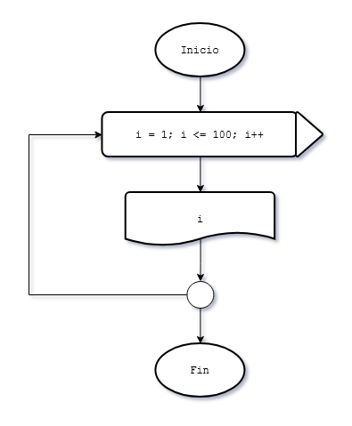
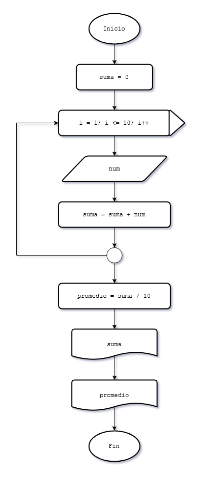
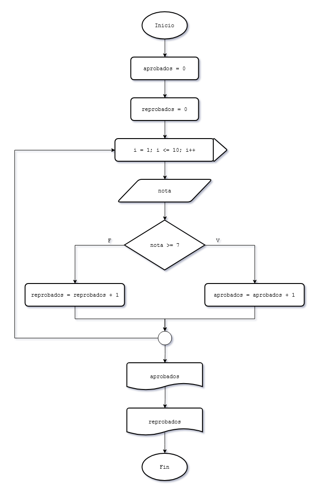
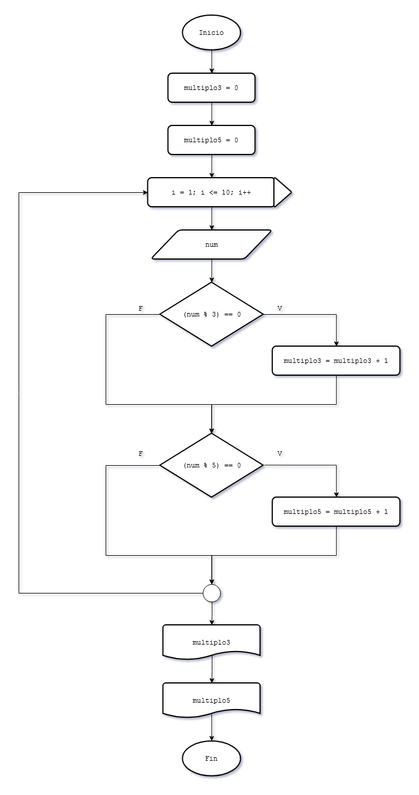
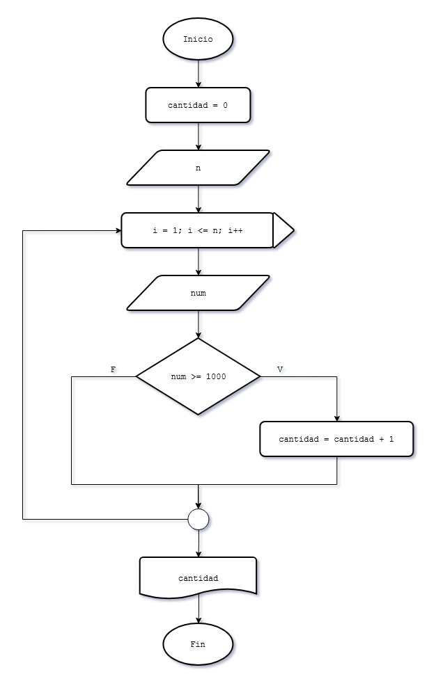

# 9 - Estructura repetitiva while

### Problema 38
Realizar un programa que imprima en pantalla los números del 1 al 100.

#### Diagrama de flujo

### Problema 39
Desarrollar un programa que permita la carga de 10 valores por teclado y nos muestre posteriormente la suma de los valores ingresados y su promedio. Este problema ya lo desarrollamos empleando el while, lo resolveremos empleando la estructura for.

#### Diagrama de flujo

### Problema 40
Escribir un programa que lea 10 notas de alumnos y nos informe cuántos tienen notas mayores o iguales a 7 y cuántos menores.  
Para resolver este problema se requieren tres contadores:
* aprobados (Cuenta la cantidad de alumnos aprobados)
* reprobados (Cuenta la cantidad de reprobados)
* i (es el contador del for)

#### Diagrama de flujo

### Problema 41
Escribir un programa que lea 10 números enteros y luego muestre cuántos valores ingresados fueron múltiplos de 3 y cuántos de 5. Debemos tener en cuenta que hay números que son múltiplos de 3 y de 5 a la vez.

#### Diagrama de flujo

### Problema 42
Escribir un programa que lea n números enteros y calcule la cantidad de valores mayores o iguales a 1000.

#### Diagrama de flujo

### Problema 43
Confeccionar un programa que lea n pares de datos, cada par de datos corresponde a la medida de la base y la altura de un triángulo. El programa deberá informar:
* De cada triángulo la medida de su base, su altura y su superficie.
* La cantidad de triángulos cuya superficie es mayor a 12. 

### Problema 44
Desarrollar un programa que solicite la carga de 10 números e imprima la suma de los últimos 5 valores ingresados. 

### Problema 45
Desarrollar un programa que muestre la tabla de multiplicar del 5 (del 5 al 50). 

### Problema 46
Confeccionar un programa que permita ingresar un valor del 1 al 10 y nos muestre la tabla de multiplicar del mismo (los primeros 12 términos)  
Ejemplo: Si ingreso 3 deberá aparecer en pantalla los valores 3, 6, 9, hasta el 36. 

### Problema 47
Realizar un programa que lea los lados de n triángulos, e informar:
* De cada uno de ellos, qué tipo de triángulo es: equilátero (tres lados iguales), isósceles (dos lados iguales), o escaleno (ningún lado igual)
* Cantidad de triángulos de cada tipo.
* Tipo de triángulo que posee menor cantidad. 

### Problema 48
Escribir un programa que pida ingresar coordenadas (x,y) que representan puntos en el plano.  
Informar cuántos puntos se han ingresado en el primer, segundo, tercer y cuarto cuadrante. Al comenzar el programa se pide que se ingrese la cantidad de puntos a procesar. 

### Problema 49
Se realiza la carga de 10 valores enteros por teclado. Se desea conocer:
* La cantidad de valores ingresados negativos.
* La cantidad de valores ingresados positivos.
* La cantidad de múltiplos de 15.
* El valor acumulado de los números ingresados que son pares. 

### Problema 50
Se cuenta con la siguiente información:  
* Las edades de 5 estudiantes del turno mañana.  
* Las edades de 6 estudiantes del turno tarde.  
* Las edades de 11 estudiantes del turno noche.  
* Las edades de cada estudiante deben ingresarse por teclado.

Obtener el promedio de las edades de cada turno (tres promedios).  
Imprimir dichos promedios (promedio de cada turno).  
Mostrar por pantalla un mensaje que indique cual de los tres turnos tiene un promedio de edades menor. 