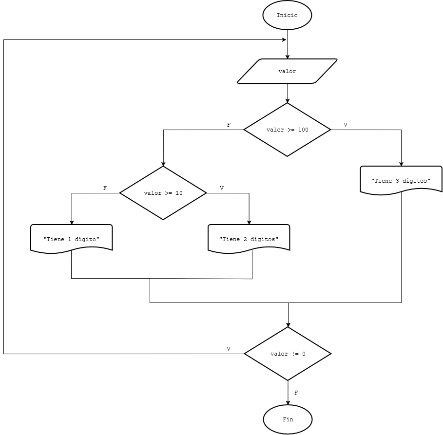
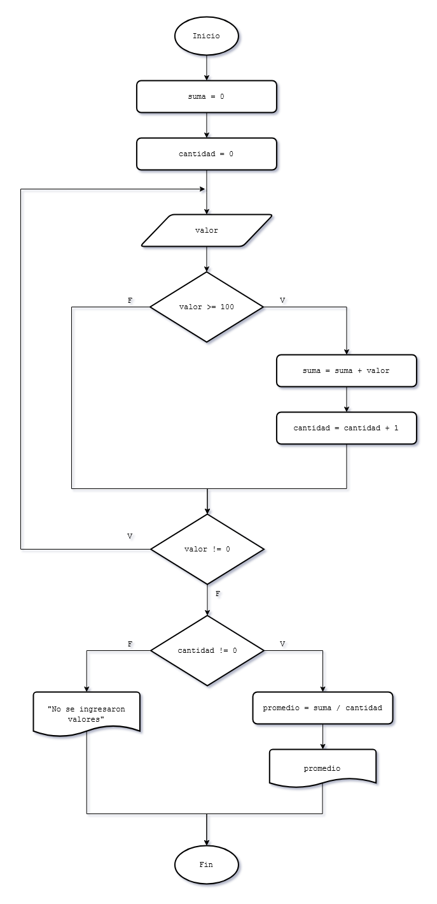
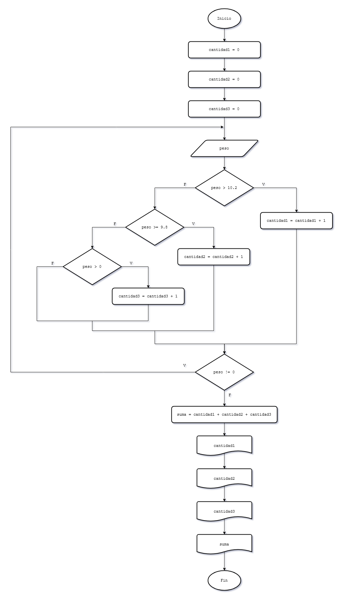

# 11 - Estructura repetitiva do while
A diferencia del ciclo `while`, que evalúa la condición al principio, el `do-while` la evalúa al final. Esto asegura que el bloque de instrucciones se ejecute **al menos una vez**, sin importar si la condición es verdadera o falsa desde el inicio.


## Funcionamiento Lógico
1. El programa entra al bloque `do` y ejecuta las instrucciones.
2. Al llegar al final del bloque, evalúa la condición del `while`.
3. Si la condición es **verdadera**, vuelve al `do` para otra iteración.
4. Si es **falsa**, el ciclo termina.

## Sintaxis en C
```c
do 
{
    // Instrucciones que se ejecutan al menos una vez
} while (condicion);
```

## Diferencia while vs do-while
* **while:** Es un ciclo de 0 a N repeticiones (puede que nunca ingrese si la condición es falsa de entrada).
* **do-while:** Es un ciclo de 1 a N repeticiones (siempre ingresa la primera vez).


## Casos de uso
* **Validacion de datos:** Es la estructura ideal para obligar al usuario a ingresar un dato correcto.
* **Menu interactivo:** El do-while es fundamental para construir menús interactivos donde primero mostramos las opciones al usuario y luego decidimos si el programa debe continuar según la opción elegida.


---
## Ejercitación

### Problema 51
Escribir un programa que solicite la carga de un número entre 0 y 999, y nos muestre un mensaje de cuántos dígitos tiene el mismo. Finalizar el programa cuando se cargue el valor 0.

#### Diagrama de flujo



### Problema 52
Escribir un programa que solicite la carga de números por teclado, obtener su promedio. Finalizar la carga de valores cuando se ingrese el valor 0.

#### Diagrama de flujo



### Problema 53
Realizar un programa que permita ingresar el peso (en kilogramos) de piezas. El proceso termina cuando ingresamos el valor 0. Se debe informar:
* ¿Cuántas piezas tienen un peso entre 9.8 Kg. y 10.2 Kg.?, ¿Cuántas con más de 10.2 Kg.? y ¿Cuántas con menos de 9.8 Kg.?
* La cantidad total de piezas procesadas. 

#### Diagrama de flujo



### Problema 54
Realizar un programa que acumule (sume) valores ingresados por teclado hasta ingresar el 9999 (no sumar dicho valor, indica que ha finalizado la carga). Imprimir el valor acumulado e informar si dicho valor es cero, mayor a cero o menor a cero.


### Problema 55
En un banco se procesan datos de las cuentas corrientes de sus clientes. De cada cuenta corriente se conoce: número de cuenta y saldo actual. El ingreso de datos debe finalizar al ingresar un valor negativo en el número de cuenta.  
Se pide confeccionar un programa que lea los datos de las cuentas corrientes e informe:
* De cada cuenta: número de cuenta y estado de la cuenta según su saldo, sabiendo que:  
Estado de la cuenta:
    * 'Acreedor' si el saldo es >0.
	* 'Deudor' si el saldo es <0.
	* 'Nulo' si el saldo es =0.

* La suma total de los saldos acreedores.